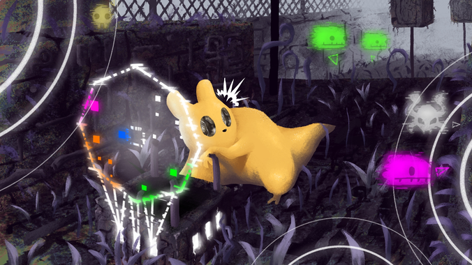

# Offscreen Indicators

Helps you gauge where and how far offscreen creatures are from your current view. Adds other tools that help show what is on the other side.

---

With either a vague understanding of the location of an unknown creature or an explicit icon, this mod will help eleviate the problem of how close another creature is from the edge of the visible space or room transitioning shortcut.

## Steam Workshop

